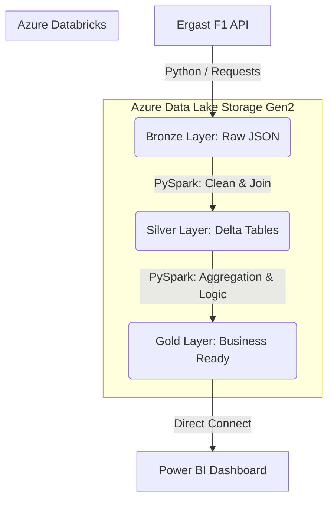
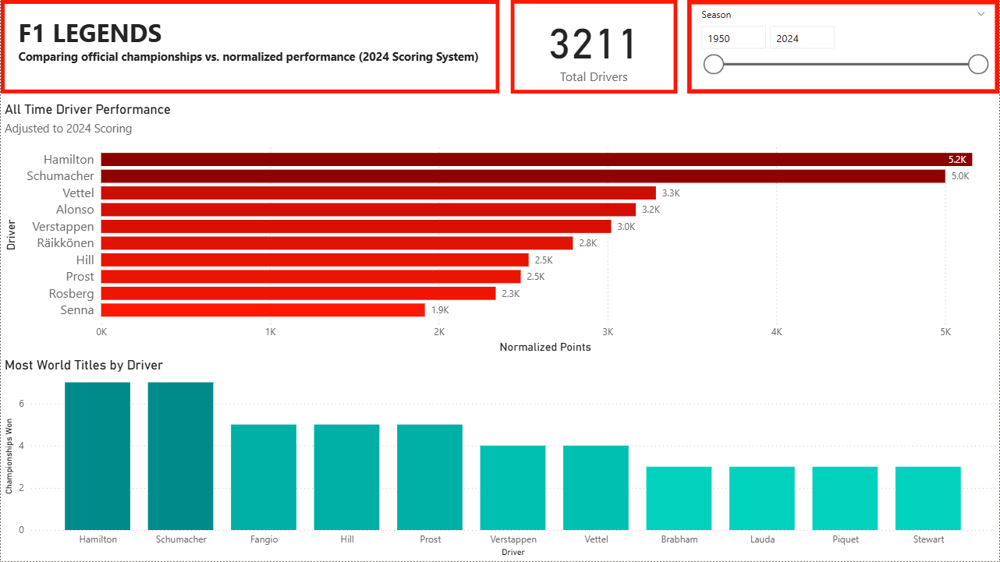
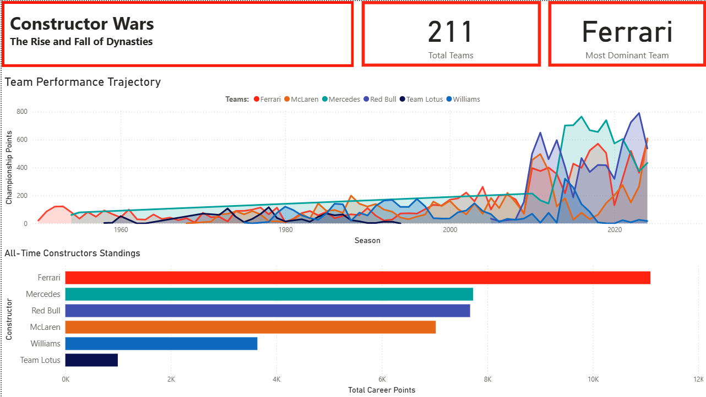
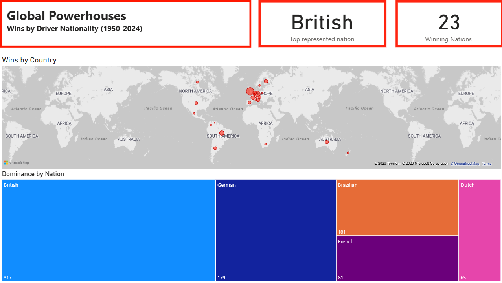

# F1_DataEngineering_Project

# 🏎️ Formula 1 Data Lakehouse & Analytics

## 📖 Project Overview
This end-to-end data engineering project builds a comprehensive Data Lakehouse to analyze 74 years of Formula 1 racing history. The goal was to answer the question: *"Who is the true G.O.A.T.?"* by normalizing points across different scoring eras and visualizing team dominance.

## 🏗️ Architecture

**Tech Stack:**
* **Cloud:** Azure (Resource Groups, Storage Accounts)
* **Storage:** Azure Data Lake Gen2 (ADLS) - Implements Medallion Architecture (Bronze, Silver, Gold)
* **Processing:** Azure Databricks (PySpark)
* **Orchestration:** Azure Data Factory (ADF)
* **Visualization:** Power BI
---

## 🏅 The Medallion Data Architecture

This project strictly adheres to the Databricks Medallion Architecture to ensure data quality and lineage.

### 🥉 Bronze Layer (Raw Data)
* **Process:** Data is fetched from the Ergast API endpoints (`drivers`, `constructors`, `races`, `results`). Because historical race results exceed API limits, Python scripts dynamically loop through seasons (1950-2024) and handle pagination.
* **State:** Data is stored in its raw `JSON` format. An `ingestion_date` audit column is added to track pipeline runs.

### 🥈 Silver Layer (Cleansed & Conformed)
* **Process:** Complex, nested JSON structures are flattened. Data types are explicitly cast (e.g., casting string dates to `TimestampType`). 
* **Data Modeling:** The raw fact table (`results`) is joined with dimension tables (`races`, `drivers`, `constructors`, `circuits`) to create a comprehensive `f1_results` master table.
* **Optimization:** The resulting Delta table is partitioned by `season` to drastically optimize downstream query performance.

### 🥇 Gold Layer (Aggregated Business Logic)
* **Process:** This layer contains report-ready data. The core transformation applies a `CASE WHEN` statement (the custom algorithm) to retroactively assign the 25-18-15... point structure to historical race finishing positions.
* **Outputs:** * `normalized_driver_standings`: Summed normalized points grouped by driver.
  * `constructor_dominance`: Year-over-year point aggregates for teams.
  * `nationality_wins`: Cleansed geospatial mapping for driver nationalities.

---

## 🚀 Key Features
* **Ingestion:** Automated data extraction from the Ergast F1 API using Python/ADF.
* **Transformation:** * **Bronze:** Raw JSON ingestion.
    * **Silver:** Data cleaning, schema enforcement, and joining normalized tables (Drivers, Constructors, Results).
    * **Gold:** Business-level aggregations (e.g., `normalized_points`, `constructor_dominance`) ready for BI.
* **Visualization:** Interactive Power BI dashboard with 3 pages (Legends, Teams, Nations) featuring dynamic "Eras of Dominance" analysis.

---

## 💻 Prerequisites & Setup Instructions

To execute this project locally or in your own Azure environment:

### 1. Azure Environment Setup
* Provision an **Azure Data Lake Storage Gen2** account and create a container named `f1-datalake`. Inside, create three directories: `bronze`, `silver`, and `gold`.
* Provision an **Azure Databricks** workspace.

### 2. Security & Access
* Create an **App Registration** in Microsoft Entra ID (formerly Azure Active Directory).
* Grant the Service Principal "Storage Blob Data Contributor" access to your ADLS account.
* Use Databricks Secret Scopes to store the Client ID, Tenant ID, and Client Secret. 

### 3. Execution
1. Clone this repository to your local machine or import it directly into Databricks Repos.
2. Spin up a Databricks cluster running **Databricks Runtime 12.2 LTS** (or higher).
3. Execute the notebooks in sequential order:
   * `01_Ingestion/ingest_api_race_results.ipynb`
   * `02_Transformation/transform_race_results.ipynb`
   * `03_Analysis/analysis_driver_scoring.ipynb`

---

## 📂 Repository Structure

```text
├── 01_Ingestion/               # API extraction and Bronze layer loading
│   ├── ingest_api_reference_data.ipynb
│   └── ingest_api_race_results.ipynb
├── 02_Transformation/          # Data cleaning and joining (Silver layer)
│   └── transform_race_results.ipynb
├── 03_Analysis/                # Business logic and scoring normalization (Gold layer)
│   ├── analysis_driver_scoring.ipynb
│   ├── analysis_constructor_dominance.ipynb
│   └── analysis_nationality_map.ipynb
├── 04_PowerBI/                 # Dashboard files and exports
│   ├── F1_Analytics_Dashboard.pbix
│   ├── Dashboard_Page1_Legends.png
│   ├── Dashboard_Page2_Teams.png
│   └── Dashboard_Page3_Nations.png
└── README.md                   # Project documentation
```

---
  
## 📊 Dashboard Previews

### Page 1: Driver Legends 🏎️
*A cross-era comparison normalizing points to the modern 2024 scoring system.*


### Page 2: Constructor Wars 🛠️
*Visualizing the rise and fall of F1 dynasties over 70 years.*


### Page 3: Global Powerhouses 🌍
*Geospatial analysis of winning nations.*

